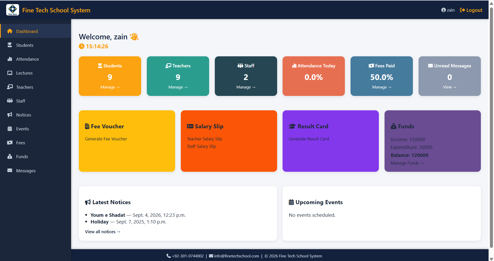
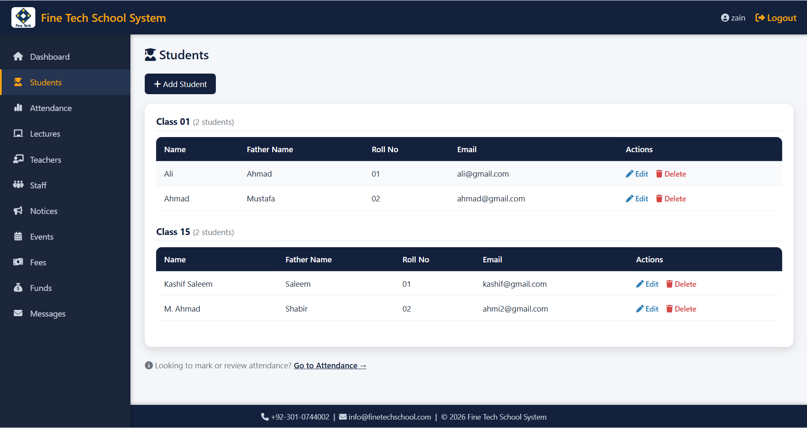
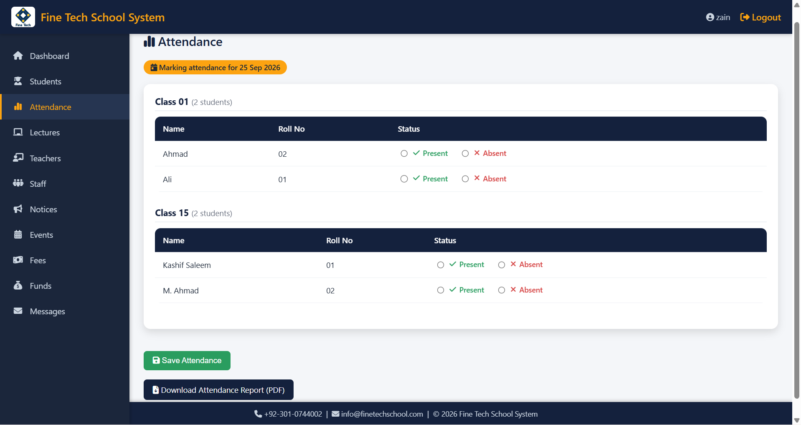
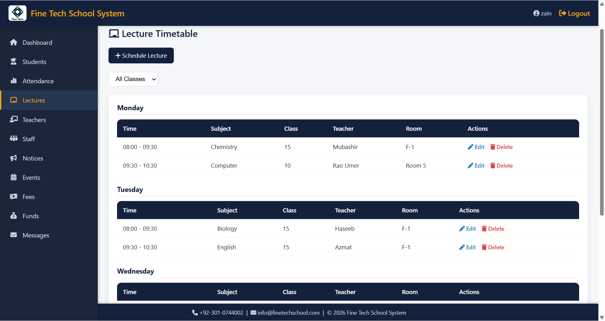

# Fine Tech School System

A Django-based school management system for handling students, teachers, staff,
attendance, fees, salaries, results, notices, events, funds, and lecture
scheduling.

## Features

- **Authentication** — secure login/signup using Django's built-in `User` model
- **Students** — manage student records, grouped by class
- **Attendance** — mark daily attendance per class, with PDF export
- **Teachers & Staff** — manage records, salary slips (PDF generation)
- **Lectures** — schedule lectures per class with automatic teacher clash detection
- **Fees** — track student fee status and generate fee vouchers (PDF)
- **Results** — generate downloadable result cards
- **Notices & Events** — school-wide announcements and calendar
- **Funds** — track income/expenditure with running balance
- **Admin panel** — all models manageable via Django admin

## Tech Stack

- **Backend:** Django 5.2
- **PDF generation:** ReportLab, xhtml2pdf
- **Database:** SQLite (development) — swap in Postgres/MySQL for production
- **Frontend:** Django templates, vanilla CSS, Font Awesome icons

## Screenshots

### Dashboard


### Students


### Attendance


### Lectures


## Getting Started

### Prerequisites
- Python 3.10+
- pip

### Setup

```bash
# Clone the repo
git clone https://github.com/<your-username>/<your-repo-name>.git
cd <your-repo-name>

# Create and activate a virtual environment
python -m venv venv
venv\Scripts\activate        # Windows
source venv/bin/activate     # macOS/Linux

# Install dependencies
pip install -r requirements.txt

# Apply database migrations
python manage.py migrate

# Create an admin account
python manage.py createsuperuser

# Run the development server
python manage.py runserver
```

Visit `http://127.0.0.1:8000/` in your browser.

### Environment Variables

This project reads configuration from environment variables. For local
development, defaults are provided so it runs out of the box. For production,
set:

| Variable                | Purpose                                  |
|-------------------------|-------------------------------------------|
| `DJANGO_SECRET_KEY`     | Django's cryptographic secret key         |
| `DJANGO_DEBUG`          | `True`/`False` — must be `False` in prod  |
| `DJANGO_ALLOWED_HOSTS`  | Comma-separated list of allowed hostnames |

## Project Structure

```
Registration/
├── registration/       # Django project settings
├── schoolapp/           # Main application (models, views, templates)
│   ├── templates/       # HTML templates
│   ├── templatetags/    # Custom template filters
│   ├── migrations/      # Database migrations
│   └── static/          # CSS, images
├── manage.py
└── requirements.txt
```

## License

This project is available for personal and educational use.
